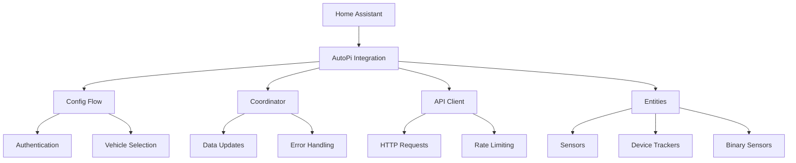

# Development

This guide provides information for developers who want to contribute to or understand the AutoPi Home Assistant integration.

## Architecture Overview

The AutoPi integration follows Home Assistant's best practices and design patterns.

### Core Components



### Component Responsibilities

| Component | Purpose | Key Files |
|-----------|---------|-----------|
| **Config Flow** | User setup and configuration | `config_flow.py` |
| **Coordinator** | Data fetching and coordination | `coordinator.py` |
| **API Client** | AutoPi API communication | `client.py` |
| **Entities** | Home Assistant entity implementations | `sensor.py`, `device_tracker.py` |
| **Base Classes** | Shared entity functionality | `entities/base.py` |

## Code Structure

### Directory Layout

```
custom_components/autopi/
├── __init__.py              # Main integration setup
├── config_flow.py           # Configuration flow
├── coordinator.py           # Data update coordinator
├── client.py               # AutoPi API client
├── const.py                # Constants and configuration
├── exceptions.py           # Custom exception classes
├── types.py                # Type definitions
├── sensor.py               # Sensor platform
├── device_tracker.py       # Device tracker platform
├── binary_sensor.py        # Binary sensor platform (future)
├── manifest.json           # Integration metadata
├── strings.json           # User-facing strings
├── translations/           # Localization files
│   └── en.json
└── entities/               # Entity base classes
    ├── __init__.py
    └── base.py
```

### Key Design Patterns

#### DataUpdateCoordinator Pattern
The integration uses Home Assistant's DataUpdateCoordinator for efficient data management:

```python
class AutoPiDataUpdateCoordinator(DataUpdateCoordinator):
    """Handles data updates from AutoPi API."""
    
    async def _async_update_data(self):
        """Fetch data from API."""
        # Implementation handles:
        # - API authentication
        # - Error handling
        # - Rate limiting
        # - Data transformation
```

#### Entity Base Classes
Shared functionality through inheritance:

```python
class AutoPiEntity(CoordinatorEntity, Entity):
    """Base class for all AutoPi entities."""
    
class AutoPiVehicleEntity(AutoPiEntity):
    """Base class for vehicle-specific entities."""
```

#### Configuration Management
Secure configuration handling:

```python
# API tokens are encrypted
# Vehicle selection is preserved
# Options can be updated without reconfiguration
```

## Development Environment

### Prerequisites

- **Python**: 3.11 or later
- **Home Assistant**: Development environment
- **Git**: Version control
- **IDE**: VS Code recommended with Python extensions

### Setup

1. **Clone Repository**:
   ```bash
   git clone https://github.com/rknightion/autopi-ha.git
   cd autopi-ha
   ```

2. **Install Dependencies**:
   ```bash
   # Using uv (recommended)
   uv sync --all-extras
   
   # Or using pip
   pip install -r requirements-dev.txt
   ```

3. **Development Tools**:
   ```bash
   # Install pre-commit hooks
   uv run pre-commit install
   
   # Run tests
   uv run pytest
   
   # Run linting
   uv run ruff check .
   uv run mypy .
   ```

### Testing

#### Unit Tests

```bash
# Run all tests
uv run pytest

# Run with coverage
uv run pytest --cov=custom_components.autopi

# Run specific test file
uv run pytest tests/test_sensor.py

# Run with debugging
uv run pytest -vv -s
```

#### Integration Testing

Test with real Home Assistant:

1. **Copy Integration**:
   ```bash
   cp -r custom_components/autopi /path/to/ha/config/custom_components/
   ```

2. **Restart Home Assistant**

3. **Add Integration** through UI

4. **Test Functionality**

#### Mock Testing

Use mocked API responses for development:

```python
@pytest.fixture
def mock_autopi_api():
    """Mock AutoPi API responses."""
    with patch("custom_components.autopi.client.AutoPiClient") as mock:
        # Configure mock responses
        yield mock
```

## API Integration

### AutoPi API Overview

The integration uses AutoPi's REST API:

- **Base URL**: `https://api.autopi.io`
- **Authentication**: Bearer token (APIToken format)
- **Rate Limits**: Varies by plan
- **Data Format**: JSON

### Key Endpoints

| Endpoint | Purpose | Frequency | Data |
|----------|---------|-----------|------|
| `/vehicle/v2/profile` | Vehicle information | Medium | Static vehicle data |
| `/logbook/v2/most_recent_positions/` | Position data | Fast | GPS, speed, altitude |

### API Client Implementation

```python
class AutoPiClient:
    """AutoPi API client with retry logic and error handling."""
    
    async def get_vehicles(self) -> List[Vehicle]:
        """Get all vehicles for the account."""
        
    async def get_positions(self, vehicle_ids: List[str]) -> Dict[str, Position]:
        """Get latest positions for specified vehicles."""
```

### Error Handling

The client implements comprehensive error handling:

- **Network errors**: Retry with exponential backoff
- **Rate limits**: Respect Retry-After headers
- **Authentication**: Trigger reauth flow
- **API errors**: Log and gracefully degrade

## Adding New Features

### Adding a New Sensor

1. **Define Sensor Class**:
   ```python
   class NewVehicleSensor(AutoPiVehicleEntity, SensorEntity):
       """New sensor for vehicles."""
       
       _attr_icon = "mdi:new-icon"
       _attr_device_class = SensorDeviceClass.TEMPERATURE
       
       def __init__(self, coordinator, vehicle_id):
           super().__init__(coordinator, vehicle_id, "new_sensor")
           self._attr_name = "New Sensor"
       
       @property
       def native_value(self):
           if vehicle := self.vehicle:
               return vehicle.new_data_field
           return None
   ```

2. **Add to Platform Setup**:
   ```python
   # In sensor.py async_setup_entry
   entities.append(NewVehicleSensor(coordinator, vehicle_id))
   ```

3. **Update Tests**:
   ```python
   def test_new_sensor(hass, mock_coordinator):
       """Test new sensor functionality."""
       # Test implementation
   ```

### Adding a New Platform

1. **Create Platform File**:
   ```python
   # binary_sensor.py
   async def async_setup_entry(hass, config_entry, async_add_entities):
       """Set up binary sensors."""
   ```

2. **Add to Constants**:
   ```python
   # const.py
   PLATFORMS = [Platform.SENSOR, Platform.DEVICE_TRACKER, Platform.BINARY_SENSOR]
   ```

3. **Update Manifest**:
   ```json
   {
     "integration_type": "hub"
   }
   ```

### Adding API Endpoints

1. **Extend Client**:
   ```python
   async def get_new_data(self, vehicle_id: str) -> NewData:
       """Fetch new data type from API."""
       url = f"{self.base_url}/new/endpoint/{vehicle_id}"
       # Implementation
   ```

2. **Update Coordinator**:
   ```python
   # Add new data fetching to coordinator
   new_data = await self.client.get_new_data(vehicle_id)
   ```

3. **Define Types**:
   ```python
   # types.py
   class NewData(TypedDict):
       field1: str
       field2: int
   ```

## Code Quality

### Linting and Formatting

The project uses several tools for code quality:

```bash
# Ruff for linting and formatting
uv run ruff check .                # Check for issues
uv run ruff check . --fix         # Auto-fix issues
uv run ruff format .               # Format code

# MyPy for type checking
uv run mypy custom_components      # Type check

# Bandit for security
uv run bandit -r custom_components # Security scan
```

### Pre-commit Hooks

Automatic checks on commit:

```yaml
# .pre-commit-config.yaml
repos:
  - repo: https://github.com/astral-sh/ruff-pre-commit
    hooks:
      - id: ruff
      - id: ruff-format
  - repo: https://github.com/pre-commit/mirrors-mypy
    hooks:
      - id: mypy
```

### Testing Standards

- **Coverage**: Aim for >90% test coverage
- **Unit tests**: Test individual components
- **Integration tests**: Test component interaction
- **Mock external services**: Don't depend on live APIs

## Documentation

### Code Documentation

Follow these documentation standards:

```python
class ExampleClass:
    """Brief description of the class.
    
    Longer description with usage examples and important notes.
    
    Attributes:
        attr1: Description of attribute
        attr2: Another attribute
    """
    
    def method(self, param: str) -> bool:
        """Brief description of method.
        
        Args:
            param: Description of parameter
            
        Returns:
            Description of return value
            
        Raises:
            ValueError: When parameter is invalid
        """
```

### User Documentation

Documentation is built with MkDocs:

```bash
# Generate entity documentation
uv run python scripts/generate_docs.py

# Local development server
mkdocs serve

# Build documentation
mkdocs build
```

## Release Process

### Version Management

1. **Update Version**:
   ```bash
   # Update manifest.json
   "version": "X.Y.Z"
   ```

2. **Update Changelog**:
   ```markdown
   ## [X.Y.Z] - YYYY-MM-DD
   ### Added
   - New feature
   ### Fixed
   - Bug fix
   ```

3. **Create Release**:
   ```bash
   git tag -a vX.Y.Z -m "Release X.Y.Z"
   git push origin vX.Y.Z
   ```

### CI/CD Pipeline

GitHub Actions handle:

- **Testing**: Run tests on multiple Python versions
- **Linting**: Code quality checks
- **Security**: Security scanning
- **Release**: Automatic release creation

## Contributing Guidelines

### Pull Request Process

1. **Fork Repository**
2. **Create Feature Branch**:
   ```bash
   git checkout -b feature/new-feature
   ```
3. **Make Changes** with tests
4. **Run Quality Checks**:
   ```bash
   make check-all
   ```
5. **Submit Pull Request**

### Code Review

Pull requests are reviewed for:

- **Functionality**: Does it work as intended?
- **Code quality**: Follows project standards?
- **Tests**: Adequate test coverage?
- **Documentation**: Changes documented?
- **Breaking changes**: Properly noted?

### Issue Reporting

When reporting issues:

1. **Search existing issues**
2. **Use issue templates**
3. **Provide reproduction steps**
4. **Include relevant logs**
5. **Specify environment details**

## Debugging

### Debug Logging

Enable detailed logging:

```yaml
# configuration.yaml
logger:
  default: info
  logs:
    custom_components.autopi: debug
    custom_components.autopi.client: debug
    custom_components.autopi.coordinator: debug
```

### Common Debug Techniques

1. **API Communication**:
   ```python
   _LOGGER.debug("API request: %s", url)
   _LOGGER.debug("API response: %s", response.json())
   ```

2. **Data Flow**:
   ```python
   _LOGGER.debug("Vehicle data: %s", vehicle_data)
   _LOGGER.debug("Entity state: %s", self.state)
   ```

3. **Error Handling**:
   ```python
   try:
       result = await self.api_call()
   except Exception as err:
       _LOGGER.exception("Unexpected error: %s", err)
       raise
   ```

### Development Tools

Useful tools for debugging:

- **Home Assistant Logs**: Real-time log monitoring
- **Developer Tools**: Entity state inspection
- **Network Monitor**: API call analysis
- **Database Browser**: Historical data review

## Future Architecture

### Planned Improvements

- **Local API Support**: If AutoPi adds local connectivity
- **WebSocket Integration**: Real-time updates
- **Plugin Architecture**: Extensible data sources
- **Enhanced Caching**: Better performance
- **ML Integration**: Predictive features

### Scalability Considerations

- **Multi-account Support**: Multiple AutoPi accounts
- **Fleet Management**: Enterprise features
- **Data Pipeline**: Streaming data processing
- **Cloud Integration**: Enhanced cloud services 